<h1> Vedant Prajapati </h1>

**Activity 1**

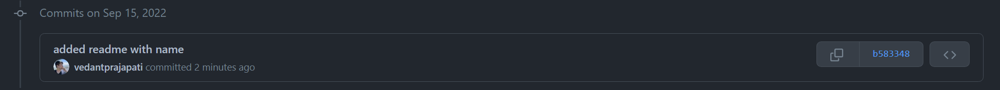

**Activity 2**

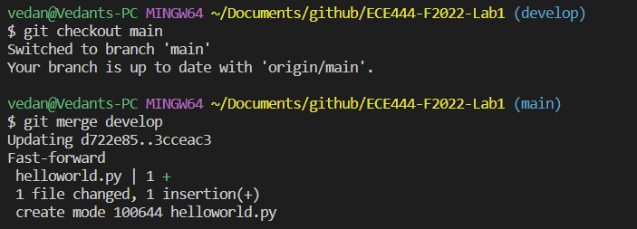


**Activity 3**

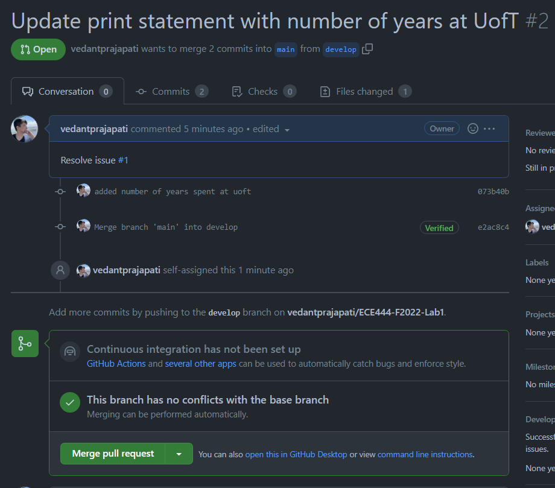

**Activity 4**

https://github.com/KyleBlackie/ECE444-F2022-Lab1

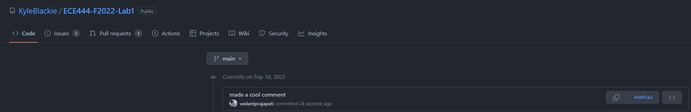


**Activity 5**

commands run:

```
$ git checkout rebase
$ git rebase develop
// Resolved conflicts

$ git checkout develop
$ git merge rebase
// develop branch now has commits c1 and c2 after c3 and c4
```

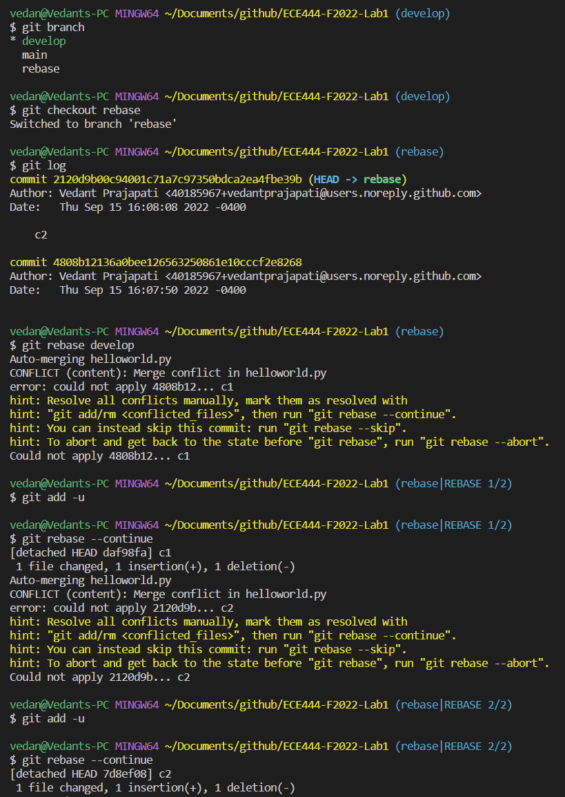

Note: I ran git merge rebase from develop after running git rebase develop
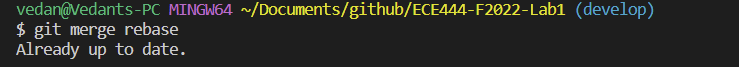

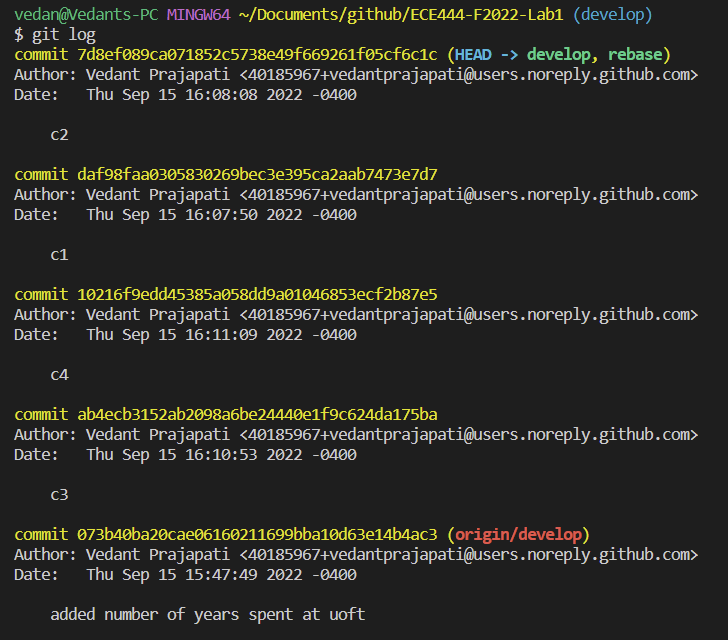

**Activity 6**
link to EP repo
```
https://github.com/vedantprajapati/ECE444-F2022-EP 
```
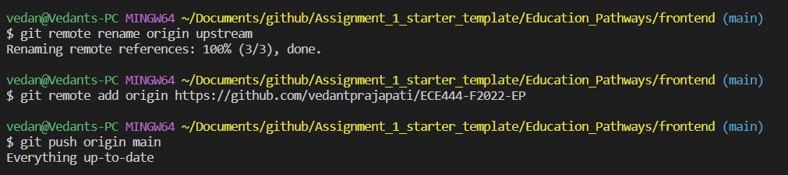

**Activity 7**

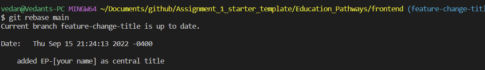

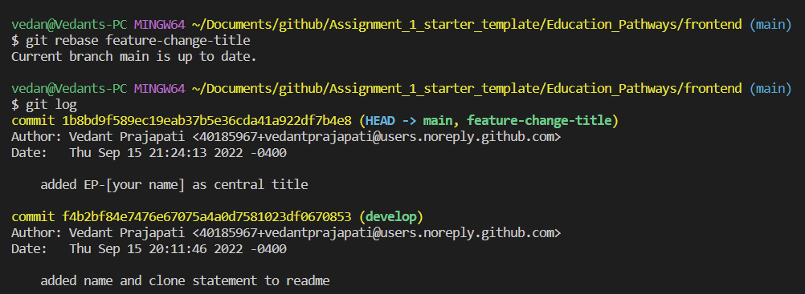

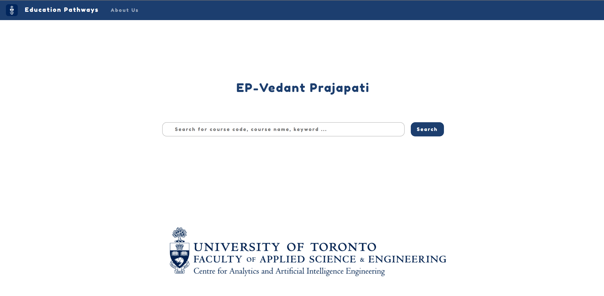

**Activity 8**

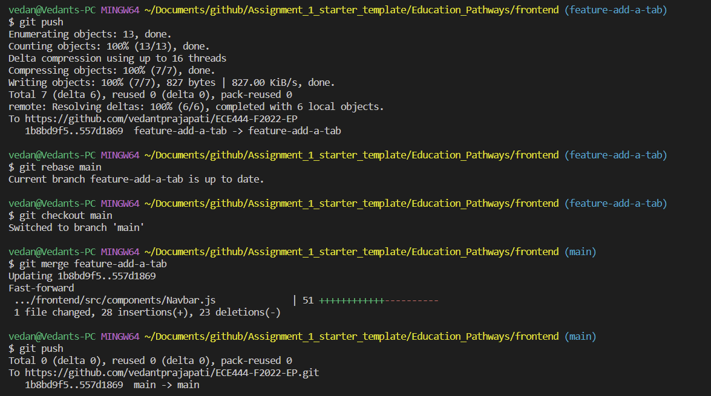

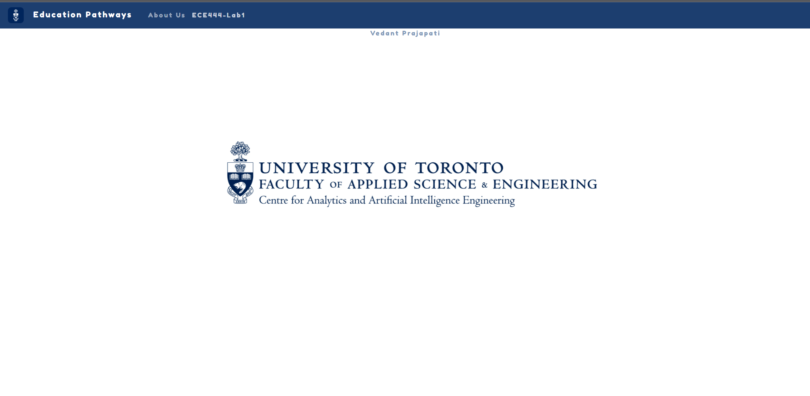

**Activity 9**

All activities have been completed.
Note: Activity 4 was completed after completing all the other activities.

